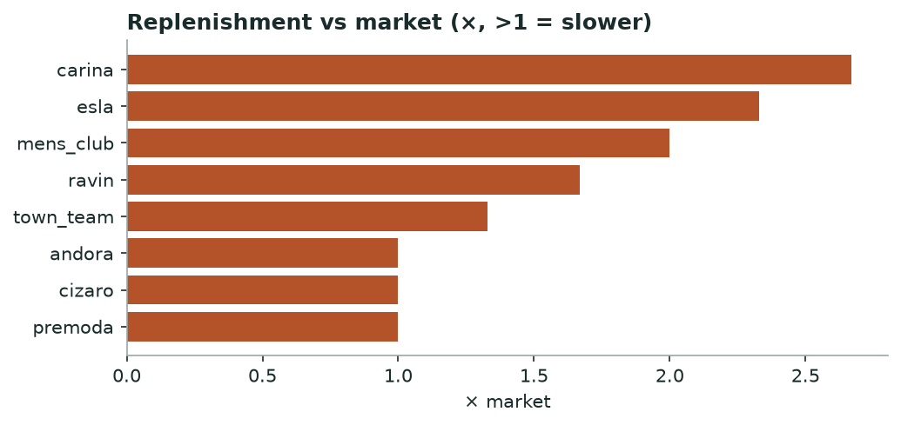

# Khabar — Supply Chain Stress & Brand Health
*Monthly · replenishment, availability, markdown distress & dead stock*

## Decision brief — what to act on
- **carina** under stress — restocks 2.7× slower than market; only 31% of sellouts return; 22 escalating markdowns.
- **town_team** under stress — only 15% of sellouts return; 30 escalating markdowns; 23 dead-stock lines.
- Benchmark the client's restock lag against the slow brands here. [confirmed · 16 brands, 8,048 cycles]

## Brands that need attention

| Brand | Health | Replen vs mkt (×) | Availability % | Distress markdowns | Dead stock | Training risk |
|---|---|---|---|---|---|---|
| carina | 🔴 stress | 2.67 | 31.0 | 22 | 0 | healthy |
| town_team | 🔴 stress | 1.33 | 15.0 | 30 | 23 | healthy |
| mens_club | 🟡 watch | 2.0 | 17.0 | 9 | 13 | healthy |
| ravin | 🟡 watch | 1.67 | 30.0 | 0 | 0 |  |
| tomato | 🟡 watch | 0.33 | 27.0 | 14 | 0 | high |

_15 other brands read healthy and are omitted for brevity._

*Brands restocking slower than the market median.*

**→ Do:** Brands well above 1× restock materially slower than rivals — a supply constraint a client can be benchmarked against.

---
### Method & confidence
- Health = count of stress flags (slow replen, low availability, distress markdowns, dead stock, high training risk): 3+ = stress, 2 = watch.

*Auto-generated 2026-08-01. Confidence tiers: confirmed / directional / maturing — based on brands covered, days observed, and event volume.*