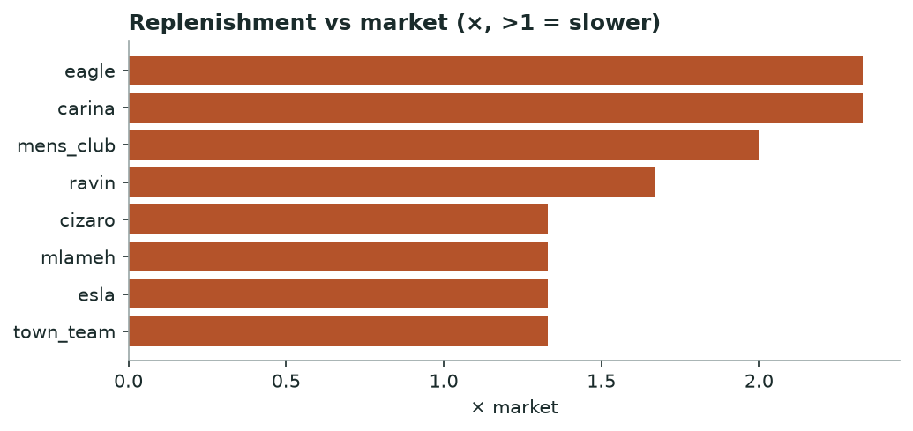

# Khabar — Supply Chain Stress & Brand Health
*Monthly · replenishment, availability, markdown distress & dead stock*

## Decision brief — what to act on
- **town_team** under stress — only 15% of sellouts return; 62 escalating markdowns; 95 dead-stock lines.
- Benchmark the client's restock lag against the slow brands here. [confirmed · 18 brands, 18,874 cycles]

## Brands that need attention

| Brand | Health | Replen vs mkt (×) | Availability % | Distress markdowns | Dead stock | Training risk |
|---|---|---|---|---|---|---|
| town_team | 🔴 stress | 1.33 | 15.0 | 62 | 95 | healthy |
| defacto | 🟡 watch |  |  | 721 | 38 | watch |
| carina | 🟡 watch | 2.33 | 19.0 | 0 | 0 | healthy |
| eagle | 🟡 watch | 2.33 | 19.0 | 0 | 0 |  |
| lc_waikiki | 🟡 watch |  | 82.0 | 1437 | 0 | high |
| mens_club | 🟡 watch | 2.0 | 8.0 | 10 | 8 | healthy |
| ravin | 🟡 watch | 1.67 | 25.0 | 0 | 0 |  |

_13 other brands read healthy and are omitted for brevity._

*Brands restocking slower than the market median.*

**→ Do:** Brands well above 1× restock materially slower than rivals — a supply constraint a client can be benchmarked against.

---
### Method & confidence
- Health = count of stress flags (slow replen, low availability, distress markdowns, dead stock, high training risk): 3+ = stress, 2 = watch.

*Auto-generated 2026-09-01. Confidence tiers: confirmed / directional / maturing — based on brands covered, days observed, and event volume.*