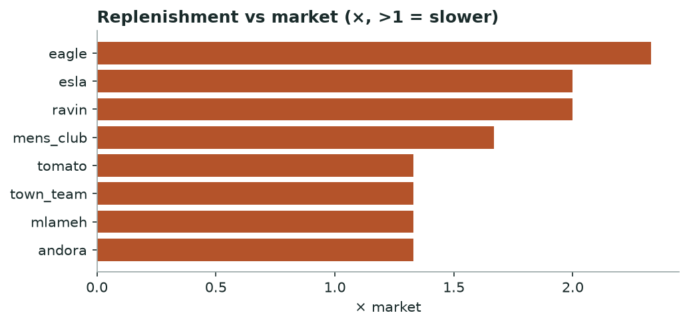

# Khabar — Supply Chain Stress & Brand Health
*Monthly · replenishment, availability, markdown distress & dead stock*

## Decision brief — what to act on
- **mens_club** under stress — restocks 1.7× slower than market; only 5% of sellouts return; 52 escalating markdowns.
- **lc_waikiki** under stress — 801 escalating markdowns; 469 dead-stock lines.
- **town_team** under stress — only 12% of sellouts return; 89 escalating markdowns; 104 dead-stock lines.
- Benchmark the client's restock lag against the slow brands here. [confirmed · 18 brands, 37,647 cycles]

## Brands that need attention

| Brand | Health | Replen vs mkt (×) | Availability % | Distress markdowns | Dead stock | Training risk |
|---|---|---|---|---|---|---|
| mens_club | 🔴 stress | 1.67 | 5.0 | 52 | 10 | watch |
| lc_waikiki | 🔴 stress |  | 92.0 | 801 | 469 | high |
| town_team | 🔴 stress | 1.33 | 12.0 | 89 | 104 | watch |
| defacto | 🟡 watch |  |  | 28 | 16 | watch |
| esla | 🟡 watch | 2.0 | 34.0 | 0 | 5 | healthy |
| ravin | 🟡 watch | 2.0 | 32.0 | 0 | 0 |  |

_14 other brands read healthy and are omitted for brevity._

*Brands restocking slower than the market median.*

**→ Do:** Brands well above 1× restock materially slower than rivals — a supply constraint a client can be benchmarked against.

---
### Method & confidence
- Health = count of stress flags (slow replen, low availability, distress markdowns, dead stock, high training risk): 3+ = stress, 2 = watch.

*Auto-generated 2026-10-01. Confidence tiers: confirmed / directional / maturing — based on brands covered, days observed, and event volume.*