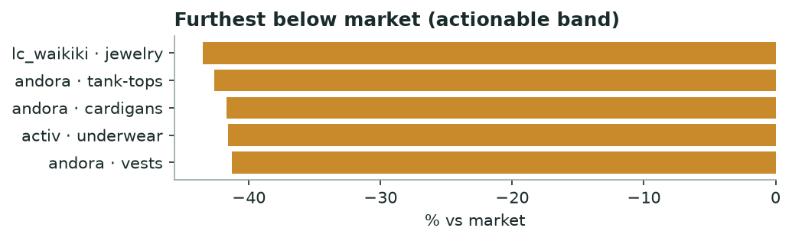

# Khabar — Brand Gap Map
*Monthly · price position, category whitespace, discount timing & honesty*

## Decision brief — what to act on
- Test a price rise: lc_waikiki / jewelry (-44% below peers). [confirmed · 22 brands, 63,390 events]
- Target unclaimed categories; avoid head-on entry into dominated ones. [confirmed · 21 brands, 10,542 events]
- Re-time discounts against the category's first mover. [directional · 15 brands, 139 events]
- Use inflated-anchor brands as a positioning contrast. [confirmed · 13 brands, 15,285 events]

## Who is leaving money on the table (price position)

| Brand | Category | Brand median | Market median | vs market % |
|---|---|---|---|---|
| lc_waikiki | jewelry | 229.0 | 405.0 | -43.5 |
| andora | tank-tops | 229.0 | 399.0 | -42.6 |
| andora | cardigans | 449.0 | 770.0 | -41.7 |
| activ | underwear | 262.0 | 449.0 | -41.6 |
| andora | vests | 499.0 | 850.0 | -41.3 |

*Priced below peers with room to raise.*

**→ Do:** **lc_waikiki · jewelry** sits 44% under the market median — the clearest margin test on the board.

_Flagged to verify (>45% gap — likely a category-mix mismatch, not true underpricing): khotwh·bags, 2s_egypt·kaftans, andora·bags._

## Category whitespace & who owns the launch flow

| Category | Brand | Share of launches % | Read |
|---|---|---|---|
| sportswear | lc_waikiki | 93.9 | dominating the category launch flow |
| leggings | lc_waikiki | 92.7 | dominating the category launch flow |
| coats | lc_waikiki | 83.6 | dominating the category launch flow |
| jewelry | lc_waikiki | 74.5 | dominating the category launch flow |
| tank-tops | defacto | 72.0 | dominating the category launch flow |

**→ Do:** Single-brand-dominated categories are saturated — enter only with a differentiated product. Categories with no dominant launcher are whitespace.

## Who moves first on discounts

| Category | Brand | Days after category first | Read |
|---|---|---|---|
| t-shirts | town_team | 0.0 | first mover — sets the category pace |
| leggings | defacto | 0.0 | first mover — sets the category pace |
| kaftans | carina | 0.0 | first mover — sets the category pace |
| scarves | defacto | 0.0 | first mover — sets the category pace |
| sportswear | activ | 0.0 | first mover — sets the category pace |

**→ Do:** Leading discounts (day 0) trains your own shopper to wait — follow instead. Always following late cedes first-mover sell-through — move earlier.

## Fake-discount flags

| Brand | Category | Claimed % | Genuine % | Gap % |
|---|---|---|---|---|
| tie_house | shirts | 53.0 | 9.1 | 43.9 |
| khotwh | polos | 48.3 | 13.2 | 35.2 |
| mens_club | shorts | 57.5 | 26.5 | 30.9 |
| mens_club | shirts | 62.7 | 32.2 | 30.5 |
| mens_club | t-shirts | 60.8 | 31.1 | 29.6 |

**→ Do:** These advertise deeper discounts than the real drop from baseline. Position honest pricing against them; never benchmark RRP to their anchor.

---
### Method & confidence
- Price source: hot + cold (R2 lake, prices only, 45d). Sustained price = median per product over the window; brand median vs market median per category (≥15 products/brand, ≥4 brands). Absolute price, not like-for-like product matching.
- Share of launch = brand's new SKUs / all brands' new SKUs in the category, last 30 days.
- Honesty = advertised depth vs genuine drop from first-observed price. Only brands publishing an RRP are scored.

*Auto-generated 2026-08-01. Confidence tiers: confirmed / directional / maturing — based on brands covered, days observed, and event volume.*