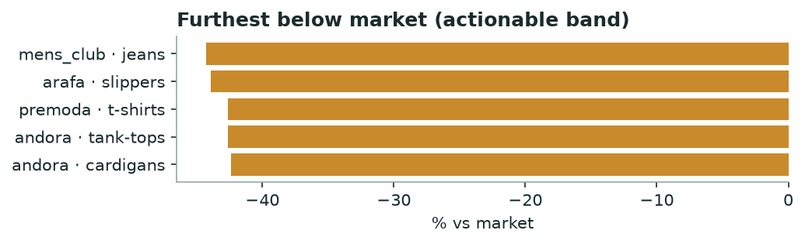

# Khabar — Brand Gap Map
*Monthly · price position, category whitespace, discount timing & honesty*

## Decision brief — what to act on
- Test a price rise: mens_club / jeans (-44% below peers). [confirmed · 21 brands, 61,021 events]

## Who is leaving money on the table (price position)

| Brand | Category | Brand median | Market median | vs market % |
|---|---|---|---|---|
| mens_club | jeans | 445.0 | 799.0 | -44.3 |
| arafa | slippers | 280.0 | 499.0 | -43.9 |
| premoda | t-shirts | 229.0 | 399.0 | -42.6 |
| andora | tank-tops | 229.0 | 399.0 | -42.6 |
| andora | cardigans | 449.0 | 780.0 | -42.4 |

*Priced below peers with room to raise.*

**→ Do:** **mens_club · jeans** sits 44% under the market median — the clearest margin test on the board.

_Flagged to verify (>45% gap — likely a category-mix mismatch, not true underpricing): khotwh·bags, andora·bags, andora·dresses._

---
### Method & confidence
- Price source: hot + cold (R2 lake, prices only, 45d). Sustained price = median per product over the window; brand median vs market median per category (≥15 products/brand, ≥4 brands). Absolute price, not like-for-like product matching.

*Auto-generated 2026-09-01. Confidence tiers: confirmed / directional / maturing — based on brands covered, days observed, and event volume.*