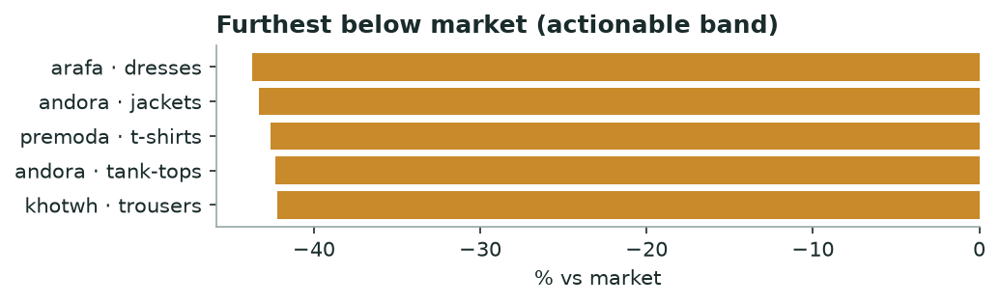

# Khabar — Brand Gap Map
*Monthly · price position, category whitespace, discount timing & honesty*

## Decision brief — what to act on
- Test a price rise: arafa / dresses (-44% below peers). [confirmed · 20 brands, 62,900 events]

## Who is leaving money on the table (price position)

| Brand | Category | Brand median | Market median | vs market % |
|---|---|---|---|---|
| arafa | dresses | 450.0 | 799.0 | -43.7 |
| andora | jackets | 850.0 | 1500.0 | -43.3 |
| premoda | t-shirts | 229.0 | 399.0 | -42.6 |
| andora | tank-tops | 229.0 | 397.0 | -42.3 |
| khotwh | trousers | 438.0 | 758.0 | -42.2 |

*Priced below peers with room to raise.*

**→ Do:** **arafa · dresses** sits 44% under the market median — the clearest margin test on the board.

_Flagged to verify (>45% gap — likely a category-mix mismatch, not true underpricing): khotwh·bags, town_team·underwear, andora·bags._

---
### Method & confidence
- Price source: hot + cold (R2 lake, prices only, 45d). Sustained price = median per product over the window; brand median vs market median per category (≥15 products/brand, ≥4 brands). Absolute price, not like-for-like product matching.

*Auto-generated 2026-10-01. Confidence tiers: confirmed / directional / maturing — based on brands covered, days observed, and event volume.*