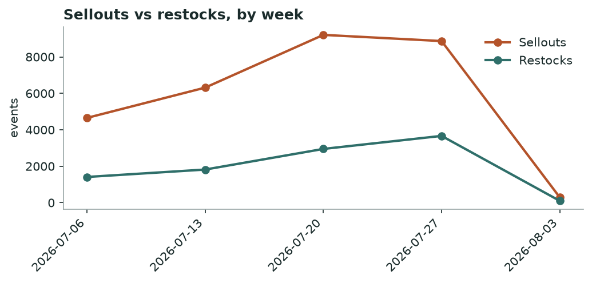
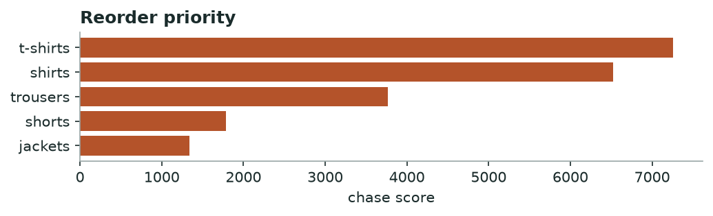

# Khabar — Market Demand & Stockout
*Weekly · witnessed sellouts & restock behaviour, all tracked brands*

## Decision brief — what to act on
- Hold discounts — market cooling, deeper cuts won't lift volume. [confirmed · 35d, 29,334 events]
- Reorder: t-shirts, shirts, trousers. [confirmed · 19 brands, 29d, 20,117 events]
- Buy deeper in sizes XL, L, M. [directional · 12 brands, 385 events]
- Time your move around rojada's uncategorized clearance. [maturing · 2 brands, 39 events]

## Is the market speeding up or slowing down?

**slowing — market clearing slower than last week** — -97% week-over-week in sellouts.

*Weekly sellouts vs restocks across all brands.*

**→ Do:** Market is cooling — hold discounts; cutting now sheds margin without moving more units.

## Where demand is outrunning supply — reorder first

| Category | Sellouts | Brands | Restock completion % | Median restock days |
|---|---|---|---|---|
| t-shirts | 6392 | 19 | 26.0 | 3.8 |
| shirts | 6870 | 21 | 31.0 | 2.6 |
| trousers | 3629 | 21 | 30.0 | 3.3 |
| shorts | 1901 | 18 | 28.0 | 2.2 |
| jackets | 1325 | 15 | 31.0 | 3.3 |

*Higher = selling out faster than it comes back.*

**→ Do:** Reorder **t-shirts, shirts, trousers** first — high sellouts with slow, incomplete restock is unmet demand, not noise.

## Sizes that sell out first

Empty while the rest of the run still sits: **XL, L, M**.

## Clearance wave to watch

**rojada** is dumping **uncategorized** (20 SKUs at once).

**→ Do:** Don't discount into their wave — hold and let it pass, or match only if you share the shopper.

---
### Method & confidence
- Velocity = weekly witnessed sellouts vs restocks, all brands. Young series — read direction, not magnitude.
- Chase = sellouts × (1 − restock completion) × restock-lag. Stock-blind brands (DeFacto, Mobaco) and LCW per-size excluded.

*Auto-generated 2026-08-03. Confidence tiers: confirmed / directional / maturing — based on brands covered, days observed, and event volume.*