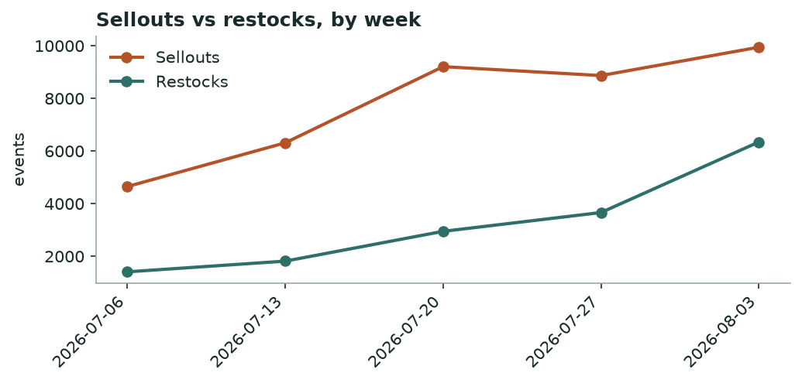
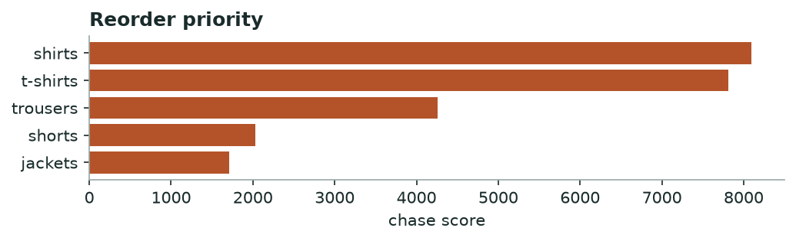

# Khabar — Market Demand & Stockout
*Weekly · witnessed sellouts & restock behaviour, all tracked brands*

## Decision brief — what to act on
- Reorder: shirts, t-shirts, trousers. [confirmed · 21 brands, 30d, 24,747 events]
- Buy deeper in sizes M, 2XL, L. [confirmed · 12 brands, 681 events]
- Time your move around tomato's t-shirts clearance. [confirmed · 1 brands, 514 events]

## Is the market speeding up or slowing down?

**steady** — +12% week-over-week in sellouts.

*Weekly sellouts vs restocks across all brands.*

## Where demand is outrunning supply — reorder first

| Category | Sellouts | Brands | Restock completion % | Median restock days |
|---|---|---|---|---|
| shirts | 8719 | 21 | 34.0 | 2.8 |
| t-shirts | 8134 | 18 | 31.0 | 2.8 |
| trousers | 4215 | 21 | 33.0 | 3.5 |
| shorts | 2207 | 18 | 31.0 | 2.3 |
| jackets | 1472 | 14 | 28.0 | 4.3 |

*Higher = selling out faster than it comes back.*

**→ Do:** Reorder **shirts, t-shirts, trousers** first — high sellouts with slow, incomplete restock is unmet demand, not noise.

## Sizes that sell out first

Empty while the rest of the run still sits: **M, 2XL, L**.

## Clearance wave to watch

**tomato** is dumping **t-shirts** (105 SKUs at once).

**→ Do:** Don't discount into their wave — hold and let it pass, or match only if you share the shopper.

---
### Method & confidence
- Velocity = weekly witnessed sellouts vs restocks, all brands. Young series — read direction, not magnitude.
- Chase = sellouts × (1 − restock completion) × restock-lag. Stock-blind brands (DeFacto, Mobaco) and LCW per-size excluded.

*Auto-generated 2026-08-10. Confidence tiers: confirmed / directional / maturing — based on brands covered, days observed, and event volume.*