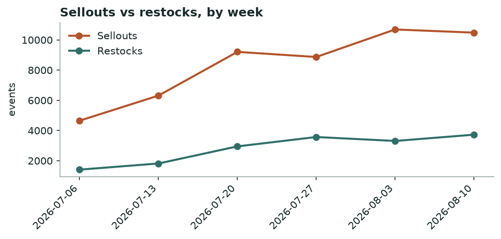
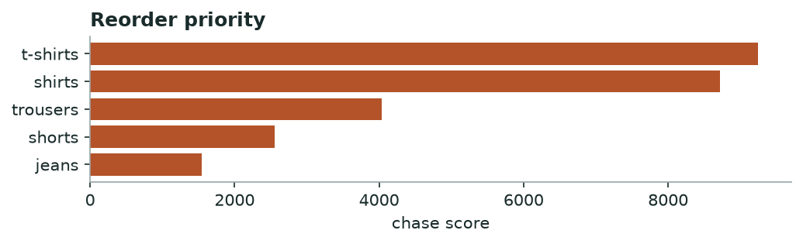

# Khabar — Market Demand & Stockout
*Weekly · witnessed sellouts & restock behaviour, all tracked brands*

## Decision brief — what to act on
- Reorder: t-shirts, shirts, trousers. [confirmed · 18 brands, 29d, 28,759 events]
- Buy deeper in sizes M, XL, L. [directional · 13 brands, 452 events]
- Time your move around activ's bags clearance. [maturing · 1 brands, 26 events]

## Is the market speeding up or slowing down?

**steady** — -2% week-over-week in sellouts.

*Weekly sellouts vs restocks across all brands.*

## Where demand is outrunning supply — reorder first

| Category | Sellouts | Brands | Restock completion % | Median restock days |
|---|---|---|---|---|
| t-shirts | 10044 | 18 | 30.0 | 2.2 |
| shirts | 10007 | 21 | 35.0 | 2.4 |
| trousers | 4254 | 21 | 33.0 | 2.9 |
| shorts | 2644 | 17 | 32.0 | 2.9 |
| jeans | 1810 | 16 | 38.0 | 2.6 |

*Higher = selling out faster than it comes back.*

**→ Do:** Reorder **t-shirts, shirts, trousers** first — high sellouts with slow, incomplete restock is unmet demand, not noise.

## Sizes that sell out first

Empty while the rest of the run still sits: **M, XL, L**.

## Clearance wave to watch

**activ** is dumping **bags** (26 SKUs at once).

**→ Do:** Don't discount into their wave — hold and let it pass, or match only if you share the shopper.

---
### Method & confidence
- Velocity = weekly witnessed sellouts vs restocks, all brands. Young series — read direction, not magnitude.
- Chase = sellouts × (1 − restock completion) × restock-lag. Stock-blind brands (DeFacto, Mobaco) and LCW per-size excluded.

*Auto-generated 2026-08-17. Confidence tiers: confirmed / directional / maturing — based on brands covered, days observed, and event volume.*