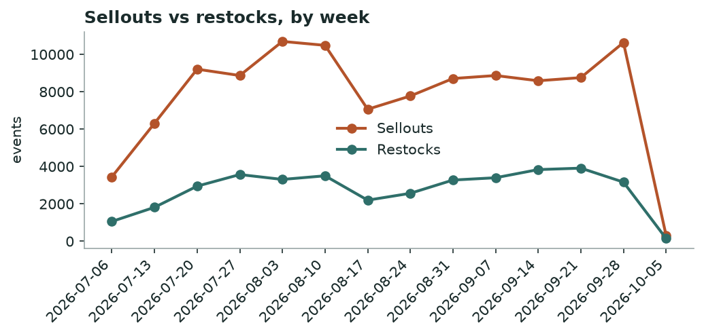
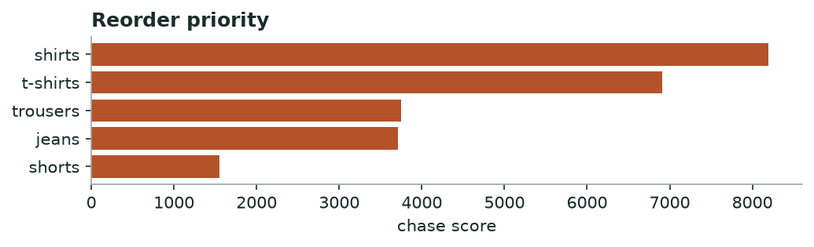

# Khabar — Market Demand & Stockout
*Weekly · witnessed sellouts & restock behaviour, all tracked brands*

## Decision brief — what to act on
- Hold discounts — market cooling, deeper cuts won't lift volume. [confirmed · 98d, 109,719 events]
- Reorder: shirts, t-shirts, trousers. [confirmed · 20 brands, 30d, 26,758 events]
- Buy deeper in sizes XL, L, M. [confirmed · 15 brands, 1,132 events]
- Time your move around defacto's sweaters clearance. [maturing · 2 brands, 72 events]

## Is the market speeding up or slowing down?

**slowing — market clearing slower than last week** — -97% week-over-week in sellouts.

*Weekly sellouts vs restocks across all brands.*

**→ Do:** Market is cooling — hold discounts; cutting now sheds margin without moving more units.

## Where demand is outrunning supply — reorder first

| Category | Sellouts | Brands | Restock completion % | Median restock days |
|---|---|---|---|---|
| shirts | 8764 | 20 | 36.0 | 3.3 |
| t-shirts | 7579 | 18 | 32.0 | 2.4 |
| trousers | 4253 | 20 | 37.0 | 2.9 |
| jeans | 4601 | 16 | 42.0 | 2.8 |
| shorts | 1561 | 17 | 33.0 | 3.3 |

*Higher = selling out faster than it comes back.*

**→ Do:** Reorder **shirts, t-shirts, trousers** first — high sellouts with slow, incomplete restock is unmet demand, not noise.

## Sizes that sell out first

Empty while the rest of the run still sits: **XL, L, M**.

## Clearance wave to watch

**defacto** is dumping **sweaters** (32 SKUs at once).

**→ Do:** Don't discount into their wave — hold and let it pass, or match only if you share the shopper.

---
### Method & confidence
- Velocity = weekly witnessed sellouts vs restocks, all brands. Young series — read direction, not magnitude.
- Chase = sellouts × (1 − restock completion) × restock-lag. Stock-blind brands (DeFacto, Mobaco) and LCW per-size excluded.

*Auto-generated 2026-10-05. Confidence tiers: confirmed / directional / maturing — based on brands covered, days observed, and event volume.*